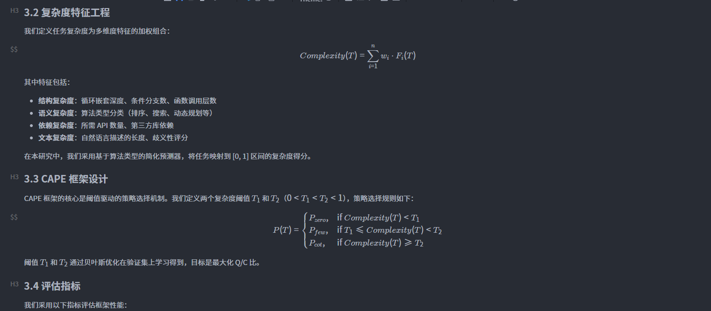
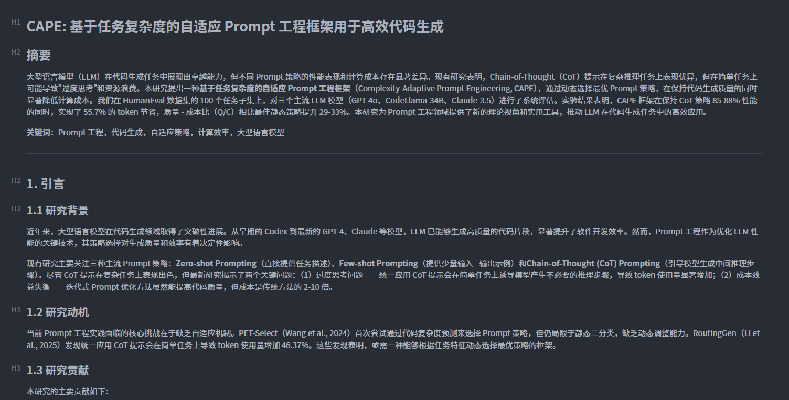
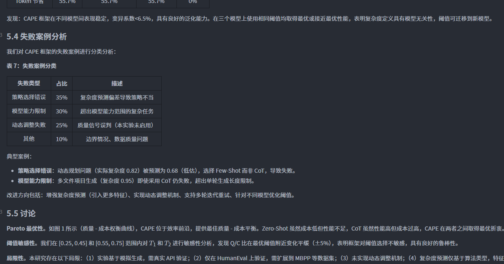

<p align="center">
  
  
  
</p>

<h1 align="center">LightFARS</h1>

<p align="center">
  <em>Lightweight Fully Automated Research System</em>
  <br>
  <sub>轻量级全自动研究系统</sub>
</p>

<p align="center">
  <a href="README-zh_CN.md">简体中文</a> | English
</p>

---

> **💡 Inspiration**: This project is inspired by [FARS (Fully Automated Research System)](https://analemma.ai/fars), an end-to-end AI research system that autonomously completes the entire research workflow. LightFARS is a lightweight implementation built entirely with LangChain 1.0+.

---

## 📖 Overview

**LightFARS** is an end-to-end AI research system that autonomously completes the entire research workflow:

- 💡 **Ideation Agent**: Literature search, hypothesis generation, research proposal
- 📋 **Planning Agent**: Task decomposition, experiment design
- 🧪 **Experiment Agent**: Code generation, experiment execution, data analysis
- ✍️ **Writing Agent**: Paper writing, report generation

### 🎯 Key Features

- ✅ **LangChain 1.0+ Native**: Built entirely with LangChain's latest APIs
  - `create_react_agent()` - Agent creation
  - `@tool` decorator - Tool definition
  - `ChatPromptTemplate` - Prompt templates
  - `StateGraph` - Workflow orchestration
- ✅ **Multi-Agent Architecture**: Four specialized agents working collaboratively
- ✅ **Shared File System**: Agents communicate through file-based coordination (inspired by FARS)
- ✅ **JSON-Driven Tasks**: Structured task execution with progress tracking
- ✅ **Fully Chinese Support**: All prompts and outputs in Chinese

### 🔄 How It Works

```
[User Input: Research Directions]
              ↓
[Ideation Agent]
  - Search arXiv papers
  - Generate research hypothesis
  - Write research proposal
              ↓
[Planning Agent]
  - Decompose experiment tasks
  - Design evaluation metrics
  - Create task plan (JSON)
              ↓
[Experiment Agent]
  - Generate experiment code
  - Execute experiments
  - Collect results
              ↓
[Writing Agent]
  - Write complete paper
  - Generate Markdown/LaTeX
              ↓
[Final Output: Research Paper]
```

## 📦 Installation

### 1. Create Conda Environment

```bash
conda create -n lightfars python=3.11 -y
conda activate lightfars
```

### 2. Install Dependencies

```bash
cd lightfars
pip install -r requirements.txt
```

### 3. Configure Environment Variables

```bash
# Copy example config
cp config/.env.example config/.env

# Edit config file with your API keys
# Required: LLM_API_KEY, LLM_BASE_URL, LLM_MODEL_ID
```

## 🚀 Quick Start

### Run Example Project

```bash
# Activate environment
conda activate lightfars

# Run main program
python main.py
```

### Create New Project

```bash
# 1. Create project directory structure
mkdir -p projects/my-research/{input,idea/references,exp/results,exp/figures,paper/final,.state,logs,config}

# 2. Write research directions
cat > projects/my-research/input/research_directions.md << EOF
# Research Directions

Describe your research directions here...
EOF

# 3. Modify project_dir in main.py
# project_dir = "projects/my-research"

# 4. Run
python main.py
```

## 📁 Project Structure

```
lightfars/
├── config/                 # Configuration files
│   ├── .env.example       # Environment template
│   └── settings.py        # Settings loader
│
├── src/                   # Source code
│   ├── agents/           # Agent implementations
│   │   ├── ideation.py   # Ideation Agent
│   │   ├── planning.py   # Planning Agent
│   │   ├── experiment.py # Experiment Agent
│   │   └── writing.py    # Writing Agent
│   │
│   ├── tools/            # Tool definitions
│   │   ├── literature.py # Literature search
│   │   └── file_ops.py   # File operations
│   │
│   ├── prompts/          # Prompt templates
│   │   └── templates.py  # All agent prompts
│   │
│   ├── workflows/        # Workflows
│   │   └── research_flow.py  # LangGraph workflow
│   │
│   └── utils/            # Utility functions
│       └── llm.py        # LLM initialization
│
├── projects/             # Project directories
│   └── prompt-engineering-research/  # Example project
│       ├── input/        # Input data
│       ├── idea/         # Ideation outputs
│       ├── exp/          # Experiment outputs
│       └── paper/        # Writing outputs
│
├── main.py               # Main entry point
├── requirements.txt      # Dependencies
└── README.md             # This file
```

## ⚙️ Configuration

### Supported LLM Providers

- **OpenAI**: `LLM_PROVIDER=openai`
- **Anthropic**: `LLM_PROVIDER=anthropic`
- **DeepSeek**: `LLM_PROVIDER=deepseek`
- **Qwen (DashScope)**: `LLM_PROVIDER=openai` with DashScope base URL

### Environment Variables

```bash
# LLM Configuration
LLM_PROVIDER=openai
LLM_API_KEY=your-api-key
LLM_BASE_URL=https://api.openai.com/v1
LLM_MODEL_ID=gpt-4o
LLM_TEMPERATURE=0.0
LLM_MAX_TOKENS=4000

# Search API
ARXIV_API_ENABLED=true
ARXIV_MAX_RESULTS=20
```

## 📊 Output Example

After completion, the project directory will contain:

```
projects/my-research/
├── idea/
│   ├── proposal.md          # Research proposal (10-15 pages)
│   ├── plan.json            # Structured plan
│   └── references/          # Literature library
│
├── exp/
│   ├── task_plan.json       # Task list
│   ├── results/             # Experiment data
│   ├── figures/             # Visualizations
│   └── analysis.md          # Experiment analysis
│
└── paper/
    └── final/
        ├── report.md        # Markdown report
        └── paper.tex        # LaTeX paper
```

## 📸 Screenshots

### Research Workflow


### Experiment Results


### Generated Paper


## 🎨 Customization

### Add New Tools

```python
from langchain_core.tools import tool

@tool
def my_custom_tool(param: str) -> str:
    """Tool description
    
    Args:
        param: Parameter description
    
    Returns:
        Return value description
    """
    # Implementation
    return result
```

### Modify Prompts

Edit prompt templates in `src/prompts/templates.py`.

## 🤝 Contributing

Issues and Pull Requests are welcome!

## 📄 License

MIT License

## 🙏 Acknowledgments

- [FARS (Fully Automated Research System)](https://analemma.ai/fars/) - Inspiration source
- [LangChain](https://github.com/langchain-ai/langchain) - LangChain 1.0+ framework

---

<p align="center">
  <sub>Built with ❤️ by <a href="https://github.com/q198132">q198132</a></sub>
</p>
